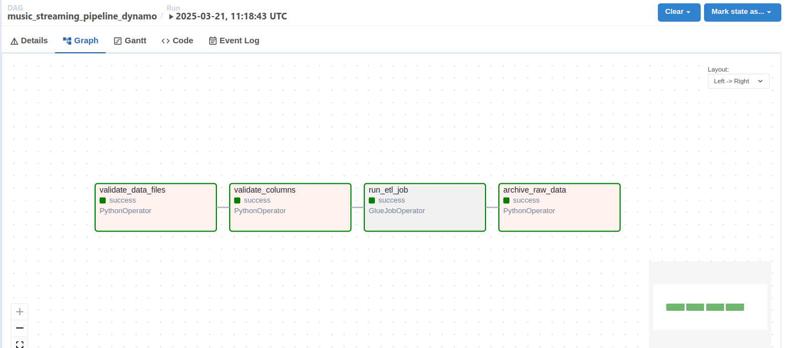

# Music Streaming ETL Pipeline - Airflow DAG

## Overview
This repository contains an Apache Airflow DAG (`music_streaming_pipeline_dynamo`) designed to orchestrate an ETL (Extract, Transform, Load) pipeline for processing music streaming data. The pipeline extracts data from Amazon S3, validates and transforms it using AWS Glue, and archives the processed data. The DAG is built to handle large datasets efficiently and ensures data integrity through validation steps.

---

## Pipeline Objectives
1. **Extract**:
   - Fetch user and song reference data from Amazon S3.
   - Fetch streaming data from Amazon S3.

2. **Validate**:
   - Validate the existence of required data files.
   - Validate the schema of the data files to ensure they contain the required columns.

3. **Transform**:
   - Use AWS Glue to perform ETL operations on the data.

4. **Archive**:
   - Move processed raw data files to an archive folder in S3 to avoid reprocessing.

---

## Pipeline Architecture
The pipeline consists of the following components:
- **Amazon S3**: Stores raw and reference data files.
- **AWS Glue**: Performs ETL operations on the data.
- **Apache Airflow**: Orchestrates the workflow and manages task dependencies.

---

## Pipeline Workflow
The pipeline is implemented as a Directed Acyclic Graph (DAG) in Airflow. Below is a breakdown of the tasks and their dependencies:

| Task ID               | Description                                                                 |
|-----------------------|-----------------------------------------------------------------------------|
| `validate_data_files` | Validates the existence of required data files in the specified S3 bucket.  |
| `validate_columns`    | Validates the schema of the data files to ensure they contain the required columns. |
| `run_etl_job`         | Executes an AWS Glue job to transform the data.                             |
| `archive_raw_data`    | Moves processed raw data files to an archive folder in S3.                  |

---

## Task Dependencies
The tasks are executed in the following order:
1. `validate_data_files` → `validate_columns` → `run_etl_job` → `archive_raw_data`

---

## Key Features
1. **Data Validation**:
   - Ensures that all required data files are present in the S3 bucket.
   - Validates the schema of the data files to ensure they contain the required columns.

2. **Error Handling**:
   - Each task includes error handling to log and raise exceptions if something goes wrong.

3. **Data Archiving**:
   - Archives processed raw data files to avoid reprocessing.

4. **Scalability**:
   - Designed to handle large datasets efficiently using AWS Glue.

---

## Airflow Connections
The DAG uses the following Airflow connections:
1. **AWS Connection**:
   - Connection ID: `aws_conn`
   - AWS Access Key ID: Your AWS access key.
   - AWS Secret Access Key: Your AWS secret key.

---

## Airflow Variables
The DAG uses the following Airflow variables:
1. **`bucket_name`**: The name of the S3 bucket where the data is stored.
2. **`glue_job_name`**: The name of the AWS Glue job to execute.
3. **`glue_script_location`**: The S3 path to the Glue script.
4. **`database_name`**: The name of the Glue database (default: `music_streams`).

---

## Pipeline Execution
- **Schedule**: The DAG is set to run manually (`schedule_interval=None`).
- **Trigger**: The DAG can be triggered manually via the Airflow UI or API.

---

## Monitoring and Logging
- **Airflow UI**: Provides real-time monitoring of task status, logs, and retries.
- **Logging**: Each task logs its progress and errors for easy debugging.

---

## Future Enhancements
1. **Incremental Data Processing**:
   - Process only new or updated data to improve efficiency.
2. **Data Validation**:
   - Add more robust data validation steps to ensure data quality.
3. **Alerting**:
   - Integrate with alerting tools (e.g., Slack, PagerDuty) to notify stakeholders of pipeline failures.
4. **Dashboard**:
   - Build a dashboard (e.g., using Tableau, Power BI, or Amazon QuickSight) to visualize the processed data.

---

## How to Use
1. **Set Up Airflow**:
   - Ensure Apache Airflow is installed and configured.
   - Set up the required Airflow connections (`aws_conn`) and variables (`bucket_name`, `glue_job_name`, `glue_script_location`, `database_name`).

2. **Deploy the DAG**:
   - Place the DAG file (`music_streaming_pipeline_dynamo.py`) in your Airflow `dags` folder.

3. **Trigger the DAG**:
   - Trigger the DAG manually via the Airflow UI or API.

4. **Monitor Progress**:
   - Use the Airflow UI to monitor the progress of the pipeline and view logs.

---
